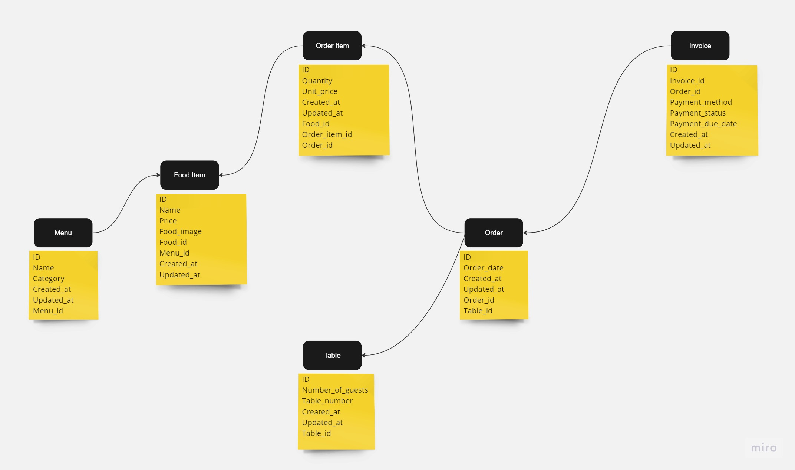

# Restaurant Management Backend 

This is a Restaurant-Backend side project written in Golang along with
database like MongoDB.

# Project Structure
```
.
├── controllers
│   ├── foodController.go
│   ├── invoiceController.go
│   ├── menuController.go
│   ├── orderController.go
│   ├── orderItemsController.go
│   ├── tableController.go
│   └── userController.go
├── database
│   └── databaseConnection.go
├── go.mod
├── go.sum
├── helpers
│   └── tokenHelper.go
├── main.go
├── middleware
│   └── authMiddleware.go
├── models
│   ├── foodModel.go
│   ├── invoiceModel.go
│   ├── menuModel.go
│   ├── noteModels.go
│   ├── orderItemModel.go
│   ├── orderModel.go
│   ├── tableModel.go
│   └── userModel.go
└── routes
    ├── foodRouter.go
    ├── invoiceRouter.go
    ├── menuRouter.go
    ├── orderItemRouter.go
    ├── orderRouter.go
    ├── tableRouter.go
    └── userRouter.go

6 directories, 28 files


```


# Authentication

This API uses JWT (JSON Web Tokens) for authentication. When a user logs in, the API generates a JWT containing the user's id, which is used to authenticate all subsequent requests. 

# Endpoints

## User

### Routes:

| Method | Url                 | Description               |
| ------ | ------------------- | ------------------------- |
| GET   | /users       | Get all users       |
| GET   | /users/:user_id         | Get user by id              |
| POST   | /users/signup        | Signup a new user            |
| POST   | /auth/login | Login existing user |

## Food

### Routes:

| Method | Url                      | Description       |
| ------ | ------------------------ | ----------------- |
| GET    | /foods     | Gets all food items |
| GET | /foods/:food_id                       | Get food item by id       |
| POST | /foods                        | Create food item       |
| PATCH  | /foods/:food_id   | Update food item     |


## Menu

### Routes:

| Method | Url                      | Description       |
| ------ | ------------------------ | ----------------- |
| GET    | /menus                   | Gets all menus |
| GET    | /menus/:menu_id          | Get menu by id       |
| POST   | /menus                   | Create menu       |
| PATCH  | /menus/:menu_id   | Update menu     |

## Table

### Routes:

| Method | Url                      | Description       |
| ------ | ------------------------ | ----------------- |
| GET    | /tables                   | Gets all tables |
| GET    | /tables/:table_id          | Get table by id       |
| POST   | /tables                   | Create table       |
| PATCH  | /tables/:table_id   | Update table     |

## Order

### Routes:

| Method | Url                      | Description       |
| ------ | ------------------------ | ----------------- |
| GET    | /orders                   | Gets all orders |
| GET    | /orders/:order_id          | Get order by id       |
| POST   | /orders                   | Create order       |
| PATCH  | /orders/:order_id   | Update order     |

## Order Item

### Routes:

| Method | Url                      | Description       |
| ------ | ------------------------ | ----------------- |
| GET    | /orderItems                   | Gets all orders items |
| GET    | /orderItems/:orderItem_id          | Get order item by id       |
| GET    | /orderItems-order/:order_id          | Get order items by order      |
| POST   | /orderItems                   | Create order item      |
| PATCH  | /orderItems/:orderItem_id   | Update order item    |

## Invoice

### Routes:

| Method | Url                      | Description       |
| ------ | ------------------------ | ----------------- |
| GET    | /invoices                   | Gets all invoices |
| GET    | /invoices/:invoice_id  | Get invoice by id     |
| POST   | /invoices                   | Create invoice      |
| PATCH  | /invoices/:invoice_id   | Update invoice    |


# Flowchart





